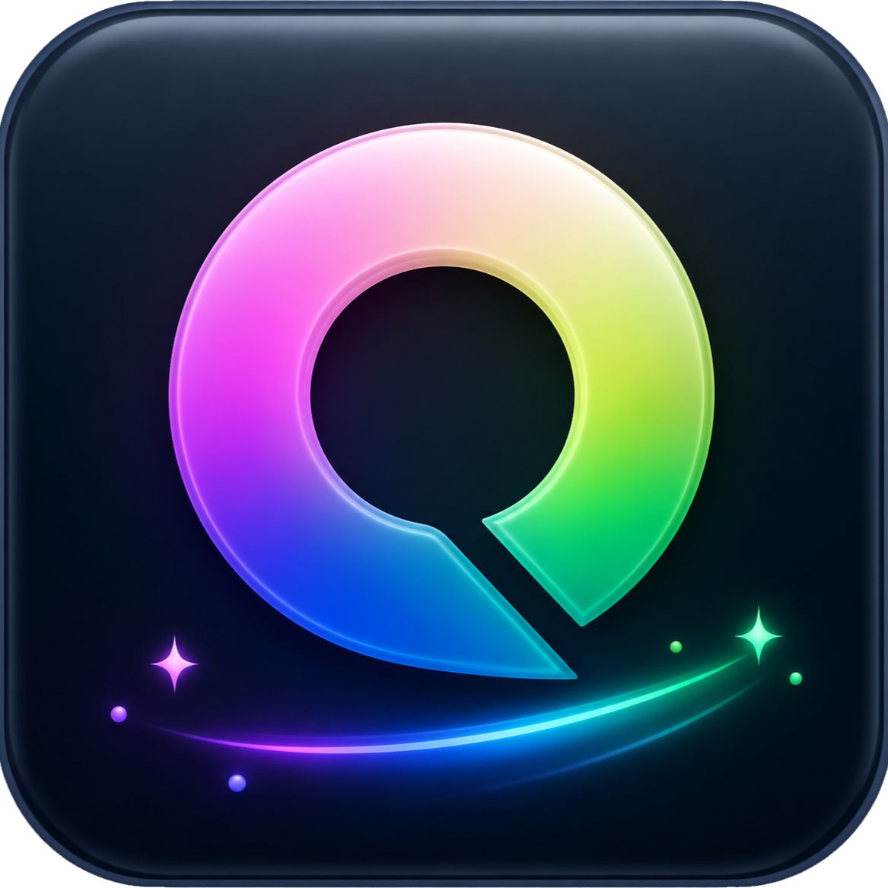

<p align="center">
  <a href="https://qingpan-ai-space.pamelamerrittgwe.chatgpt.site">
    
  </a>
</p>

<h1 align="center">轻盘 · AI 驱动的智能空间管理产品</h1>

轻盘是一款 macOS 桌面端 AI 存储分析产品。它读取本机文件元数据，帮助用户看懂磁盘空间被哪些软件占用、最近哪些应用数据比较活跃，以及哪些缓存值得优先检查。

仓库同时保留了 Web 产品原型与可安装的 Tauri 桌面版；桌面版已接入真实本机扫描，不再使用演示数据。

## 桌面版当前能力

- 读取本机磁盘总容量、已用容量和可用容量
- 扫描 `/Applications` 与当前用户的 `Applications` 目录
- 识别微信、剪映、Xcode、飞书及占用较大的其他应用
- 汇总已知应用的缓存、工程、归档等数据目录
- 显示应用体积、过去 24 小时修改过的文件体积和可检查候选
- 支持深色与浅色主题
- 支持 Gemini、DeepSeek、OpenAI，API Key 保存到 macOS 钥匙串
- 只向 AI 发送匿名化容量汇总，不发送文件路径和文件正文
- 第一版只扫描和生成建议，不执行删除

## 产品原则

- 默认只在本地扫描文件元数据
- AI 负责解释和生成建议，不直接删除文件
- 清理操作必须经过风险规则和用户确认
- 优先隔离后删除，并提供恢复记录
- 支持按应用设置空间预算和增长提醒

## 技术栈

- React 19
- TypeScript
- Tauri 2
- Rust
- Vite
- Next.js / vinext（Web 原型）

## 本地运行

需要 Node.js `>=22.13.0`、Rust stable 与 macOS Command Line Tools。

```bash
npm install
npm run tauri:dev
```

常用命令：

- `npm run tauri:dev`：启动真实桌面版
- `npm run tauri:build`：生成 `.app` 与 `.dmg` 安装包
- `npm run dev`：启动 Web 产品原型
- `npm run build`：构建 Web 产品原型
- `npm test`：构建并运行页面渲染测试
- `npm run lint`：运行代码检查

## 隐私与安全边界

- 扫描器只读取路径、大小、修改时间等元数据，不打开文件正文
- 不跟随符号链接
- 不在源码或浏览器存储中保存 API Key
- 云端 AI 仅接收应用名称与容量汇总
- “可检查候选”不等于“可以直接删除”
- 当前版本没有删除命令，因此不会误删本机文件

公开分发前仍需要 Apple Developer 证书签名与公证。下一阶段可以在现有扫描层上增加隔离区、恢复记录、清理规则和用户确认流程，界面可以继续独立迭代。
