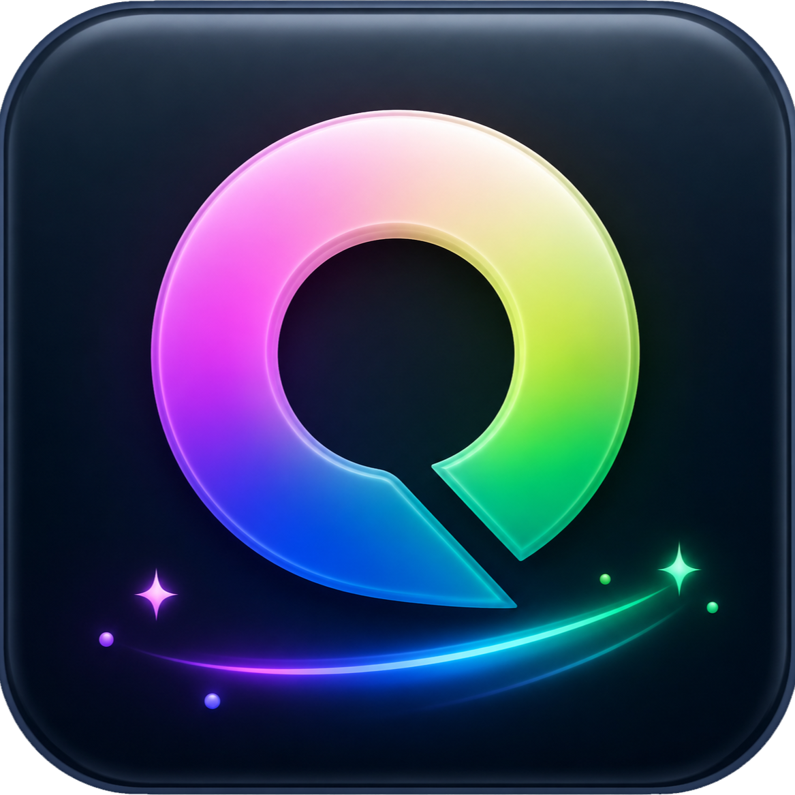

<p align="center">
  
</p>

<h1 align="center">轻盘 · AI 驱动的智能空间管理产品</h1>

轻盘是一款 macOS 桌面端 AI 存储分析产品。它扫描整台 Mac 的全部应用，对所有应用提供基础空间分析，对重点应用提供文件分类级深度分析和安全建议。

仓库同时保留了 Web 产品原型与可安装的 Tauri 桌面版；桌面版已接入真实本机扫描，不再使用演示数据。

## 桌面版当前能力

- 读取本机磁盘总容量、已用容量和可用容量
- 扫描 `/Applications`、`~/Applications`、`/System/Applications` 与系统工具目录中的全部 `.app`
- 读取应用名称、Bundle ID、版本、安装路径和图标信息，并区分系统应用与用户应用
- 对所有应用提供 `basic` 基础识别，对可信 Bundle ID 目录提供 `generic` 通用分析
- 对微信、剪映、Xcode、飞书提供 `deep` 深度规则，并按缓存、工程、聊天数据、日志等类别展示
- 使用 `safe`、`review`、`protected`、`unknown` 四级风险模型，不把未知内容声称为可安全清理
- 支持按名称和 Bundle ID 搜索，以及支持等级、应用类型筛选和多种容量排序
- 分开显示应用本体、关联数据和过去 24 小时活跃文件体积
- 支持深色与浅色主题
- 支持 Gemini、DeepSeek、OpenAI，API Key 保存到 macOS 钥匙串
- 只向 AI 发送匿名化容量汇总，不发送文件路径和文件正文
- 深度支持应用可以继续查看具体大文件，并逐项移入轻盘安全隔离区
- 提供传统清理工具：大文件扫描、重复文件查找、应用卸载和缓存分析
- 重复文件先按大小缩小候选范围，再在本机读取候选内容并计算 SHA-256 指纹，内容不会上传
- 应用卸载处理普通应用包，并可选择与 Bundle ID 完全匹配的缓存；其他关联数据继续由深度规则判断
- 隔离项目可以恢复；永久删除只能在隔离区逐项二次确认

## 产品原则

- 默认只在本地扫描文件元数据；重复文件仅在用户主动启动后读取候选内容计算本机指纹
- AI 负责解释和生成建议，不直接删除文件
- 未验证目录默认视为未知或受保护内容
- 深度规则中的 `safe` 和 `review` 项目正常开放；`protected` 仅在高级模式中单项授权，`unknown` 始终不可选择
- 受保护目录中的普通视频、图片、音频、文档、压缩包和日志按文件级规则降为 `review`，无需开启高级模式
- 数据库、工程结构文件和整目录继续保持 `protected`
- 受保护项目不能批量处理、不能与其他项目混选，也不会被 AI 自动选择
- 所有处理先隔离后删除，并保留原始路径恢复记录
- 支持按应用设置空间预算和增长提醒

## 技术栈

- React 19
- TypeScript
- Tauri 2
- Rust
- Vite
- Next.js / vinext（Web 原型）

## 本地运行

需要 Node.js `>=22.13.0`、Rust stable 与 macOS Command Line Tools。

```bash
npm install
npm run tauri:dev
```

常用命令：

- `npm run tauri:dev`：启动真实桌面版
- `npm run tauri:build`：生成 `.app` 与 `.dmg` 安装包
- `npm run dev`：启动 Web 产品原型
- `npm run build`：构建 Web 产品原型
- `npm test`：构建并运行页面渲染测试
- `npm run lint`：运行代码检查

## 隐私与安全边界

- 常规扫描只读取路径、大小、修改时间等元数据；重复文件功能仅在用户主动启动后读取候选内容计算本机指纹
- 不跟随符号链接
- 不在源码或浏览器存储中保存 API Key
- 云端 AI 仅接收应用名称与容量汇总
- “可检查候选”不等于“可以直接删除”
- 文件操作目标必须通过深度规则或传统工具限定目录、真实路径和符号链接检查
- AI 没有文件操作权限，文件名、完整路径和正文不会上传
- 永久删除只允许发生在轻盘自己的隔离区，并需要用户在界面再次确认

公开分发前仍需要 Apple Developer 证书签名与公证。下一阶段应扩充经过验证的深度应用规则、完善权限引导、隔离区容量策略和真实机器回归测试。
